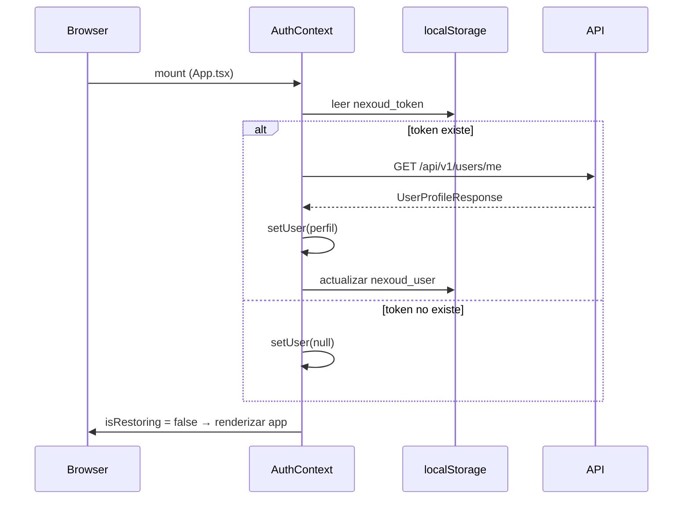
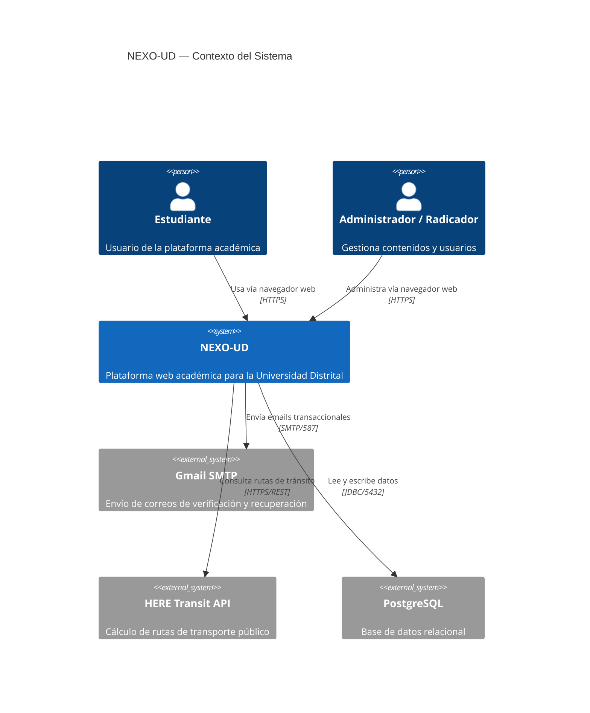
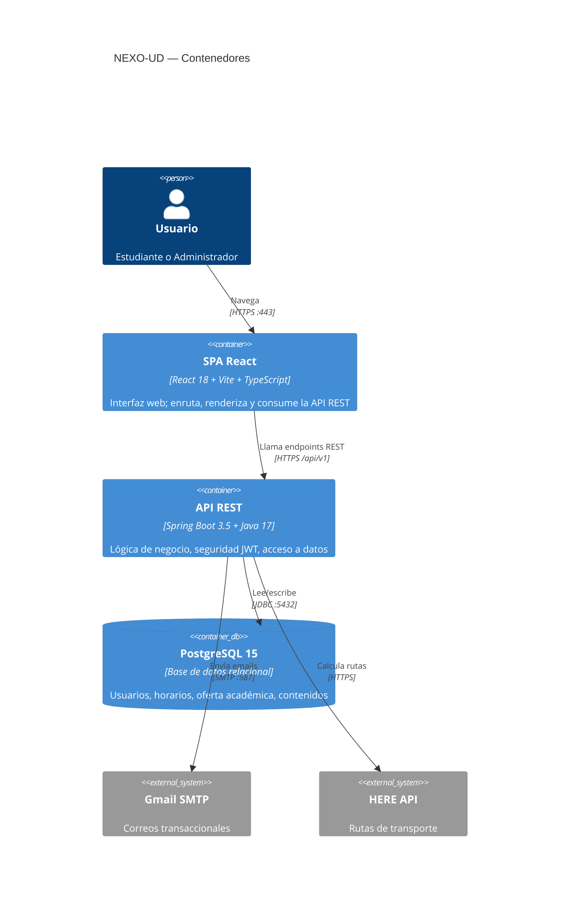
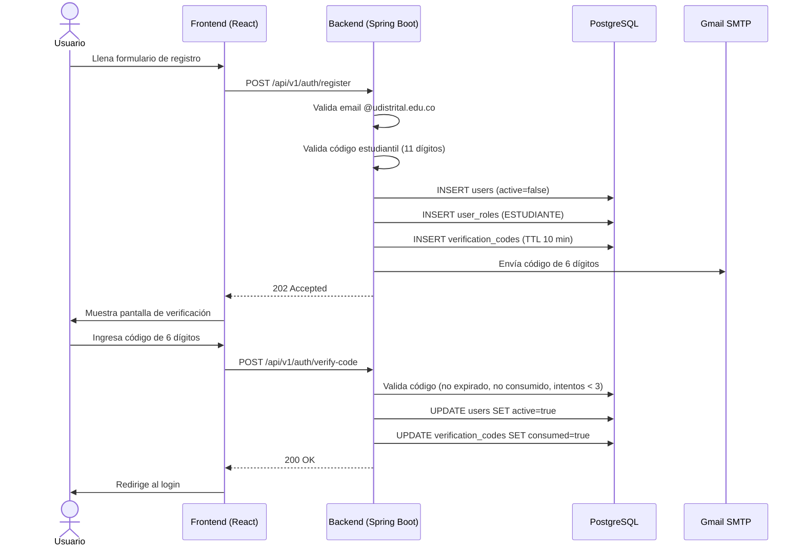
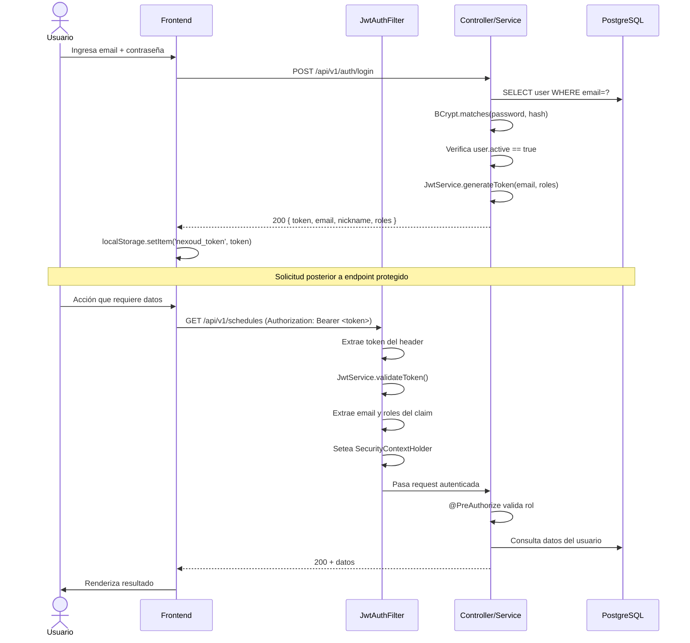
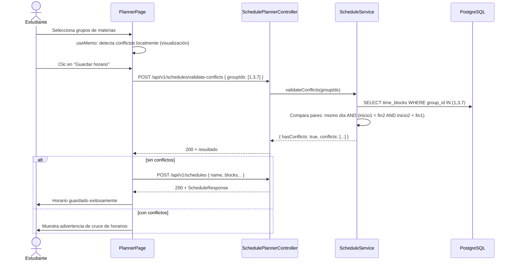

# NEXO-UD — Manual del Desarrollador

> Fuente única de verdad técnica para la inducción de nuevos colaboradores.
> Toda la información fue extraída directamente del código fuente, configuraciones y migraciones del repositorio.

---

## Tabla de Contenidos

1. [Visión General de la Arquitectura](#1-visión-general-de-la-arquitectura)
2. [Configuración y Entorno Local (Setup)](#2-configuración-y-entorno-local-setup)
3. [Topología del Dominio y Modelo de Datos](#3-topología-del-dominio-y-modelo-de-datos)
4. [Diseño de la Capa de Servicios y Lógica de Negocio](#4-diseño-de-la-capa-de-servicios-y-lógica-de-negocio)
5. [Contratos de Integración (API Layer)](#5-contratos-de-integración-api-layer)
6. [Estrategia de Pruebas (Testing)](#6-estrategia-de-pruebas-testing)
7. [Estándares y Flujo de Contribución](#7-estándares-y-flujo-de-contribución)

---

## 1. Visión General de la Arquitectura

### 1.1 Patrón Arquitectónico

NEXO-UD sigue una arquitectura **monolítica por módulos** (Modular Monolith) con separación estricta por dominios de negocio. Cada dominio tiene su propio paquete con capas internas bien definidas:

```
com.kumorai.nexo/
├── auth/          → Autenticación, registro, verificación por código
├── user/          → Gestión de usuarios, roles, progreso académico
├── academic/      → Oferta académica, planes de estudio, semestres
├── schedule/      → Armador y exportador de horarios
├── campus/        → Sedes, aulas, fotos, rutas de transporte
├── content/       → Avisos, calendario académico, bienestar
├── report/        → Reportes y retroalimentación de estudiantes
├── admin/         → Operaciones administrativas transversales
└── shared/        → Configuración, seguridad, utilidades, excepciones
```

Cada módulo sigue el patrón **MVC en capas**:

```
Controller → Service (interface + impl) → Repository (Spring Data JPA) → Entity (JPA)
```

El **frontend** es una SPA (Single Page Application) con React que consume la API REST del backend a través de un cliente HTTP centralizado.

### 1.2 Stack Tecnológico

#### Backend

| Componente | Tecnología | Versión |
|---|---|---|
| Lenguaje | Java | 17 |
| Framework principal | Spring Boot | 3.5.14 |
| Seguridad | Spring Security | 6.x (incluido en Boot 3.5) |
| Persistencia (ORM) | Spring Data JPA / Hibernate | 6.x |
| Base de datos | PostgreSQL | 15+ recomendado |
| Migraciones | Flyway | incluido en Boot 3.5 |
| Autenticación | JJWT (jjwt-api) | 0.12.6 |
| Generación de PDF | OpenPDF (librepdf) | 1.3.30 |
| Email | Spring Boot Mail (SMTP Gmail) | incluido |
| Build | Maven | 3.9+ |
| Lombok | Lombok | incluido en Boot 3.5 |
| Validación | Jakarta Validation | incluido |

#### Frontend

| Componente | Tecnología | Versión |
|---|---|---|
| Lenguaje | TypeScript | 6.0.3 |
| Framework UI | React | 18.3.1 |
| Build tool | Vite | 6.3.5 |
| Estilos | Tailwind CSS | 4.1.12 |
| Componentes base | Radix UI | varios |
| Enrutamiento | React Router | 7.x |
| Formularios | React Hook Form | — |
| Mapas | Leaflet + react-leaflet | — |
| Gráficas | Recharts | — |
| Temas | next-themes | — |

---

## 2. Configuración y Entorno Local (Setup)

### 2.1 Requisitos Previos

| Herramienta | Versión mínima | Propósito |
|---|---|---|
| JDK | 17 | Compilar y ejecutar el backend |
| Maven | 3.9 | Gestionar dependencias y ciclo de vida del backend |
| Node.js | 20 LTS | Compilar y ejecutar el frontend |
| npm | 10+ | Gestor de paquetes del frontend |
| PostgreSQL | 15 | Base de datos relacional |
| Git | 2.40+ | Control de versiones |

> **Recomendado:** Usar [SDKMAN](https://sdkman.io/) para gestionar versiones de Java y Maven en Linux/macOS.

### 2.2 Estructura de Carpetas del Repositorio

```
NEXO-UD/
├── nexo-backend/    → Spring Boot API REST
│   ├── src/
│   │   ├── main/java/com/kumorai/nexo/
│   │   ├── main/resources/
│   │   │   ├── application.properties
│   │   │   └── db/migration/       → Migraciones Flyway (V1 a V13)
│   │   └── test/java/com/kumorai/nexo/
│   └── pom.xml
└── nexo-frontend/   → React SPA
    ├── src/
    │   ├── components/
    │   ├── context/
    │   ├── pages/
    │   ├── services/
    │   └── styles/
    ├── package.json
    └── vite.config.ts
```

### 2.3 Configuración de la Base de Datos

```sql
-- Crear la base de datos antes de iniciar el backend
CREATE DATABASE nexo_db;
CREATE USER nexo_user WITH PASSWORD 'tu_password';
GRANT ALL PRIVILEGES ON DATABASE nexo_db TO nexo_user;
```

Flyway ejecuta automáticamente las migraciones al arrancar el backend. No es necesario ejecutar ningún SQL manual adicional.

### 2.4 Variables de Entorno

#### Backend — `nexo-backend/.env` (o variables de sistema)

Estas variables sobreescriben los valores de `application.properties`:

```properties
# Base de datos
DB_HOST=localhost
DB_PORT=5432
DB_NAME=nexo_db
DB_USER=postgres
DB_PASS=tu_password

# JWT — cambiar en producción por un valor seguro de mínimo 32 caracteres
JWT_SECRET=cambia-este-secreto-por-uno-seguro-de-produccion
JWT_EXPIRATION=86400000  # 24 horas en milisegundos

# Correo electrónico (Gmail)
MAIL_USERNAME=nexoud9@gmail.com
MAIL_PASSWORD=contraseña_de_aplicacion_gmail

# Directorio de subida de archivos
UPLOAD_DIR=uploads

# API de rutas HERE (transporte público)
HERE_API_KEY=tu_clave_de_here_api

# CORS — lista de orígenes permitidos separados por coma
CORS_ORIGINS=http://localhost:3000,http://localhost:5173

# Puerto del servidor (opcional, default 8080)
PORT=8080
```

#### Frontend — `nexo-frontend/.env`

```properties
VITE_API_URL=/api/v1
```

> El frontend usa un proxy de Vite en desarrollo que redirige `/api` → `http://localhost:8080`, por lo que no es necesario apuntar directamente al backend.

### 2.5 Pasos para Levantar el Entorno Local

#### Paso 1 — Clonar el repositorio

```bash
git clone <url-del-repositorio>
cd NEXO-UD
```

#### Paso 2 — Iniciar el backend

```bash
cd nexo-backend

# Copiar y configurar las variables de entorno
cp .env.example .env
# Editar .env con tus valores locales

# Compilar y ejecutar (Flyway migra automáticamente al iniciar)
./mvnw spring-boot:run

# Alternativa: compilar el JAR y ejecutarlo
./mvnw clean package -DskipTests
java -jar target/nexo-backend-0.0.1-SNAPSHOT.jar
```

El backend queda disponible en: `http://localhost:8080`

#### Paso 3 — Iniciar el frontend

```bash
cd ../nexo-frontend

# Instalar dependencias
npm install

# Iniciar servidor de desarrollo (puerto 3000)
npm run dev
```

El frontend queda disponible en: `http://localhost:3000`

#### Paso 4 — Credenciales de prueba (sembradas por Flyway)

| Email | Password | Rol |
|---|---|---|
| `admin@udistrital.edu.co` | `admin123` | ADMINISTRADOR |
| `radicador.avisos@udistrital.edu.co` | `admin123` | RADICADOR_AVISOS |
| `radicador.bienestar@udistrital.edu.co` | `admin123` | RADICADOR_BIENESTAR |
| `radicador.sedes@udistrital.edu.co` | `admin123` | RADICADOR_SEDES |
| `radicador.calendario@udistrital.edu.co` | `admin123` | RADICADOR_CALENDARIO |

> Los estudiantes se registran con correo `@udistrital.edu.co` y código estudiantil de 11 dígitos.

#### Paso 5 — Build de producción del frontend

```bash
cd nexo-frontend
npm run build
# El output queda en nexo-frontend/build/
```

---

## 3. Topología del Dominio y Modelo de Datos

### 3.1 Entidades Principales

El esquema fue creado mediante Flyway (V1 a V13). A continuación se describen las entidades centrales y sus relaciones.

#### `users` — Usuario

| Campo | Tipo | Notas |
|---|---|---|
| `id` | BIGSERIAL PK | — |
| `email` | VARCHAR(255) UNIQUE | Debe ser `@udistrital.edu.co` |
| `nickname` | VARCHAR(50) UNIQUE | Alias público del usuario |
| `password_hash` | VARCHAR(255) | BCrypt |
| `student_code` | VARCHAR(20) UNIQUE | 11 dígitos; codifica año, semestre, carrera |
| `entry_semester` | VARCHAR(10) | Derivado del código estudiantil |
| `active` | BOOLEAN | `false` hasta verificar email |
| `created_at` | TIMESTAMP | — |
| `updated_at` | TIMESTAMP | — |

#### `user_roles` — Roles de Usuario

| Campo | Tipo | Notas |
|---|---|---|
| `id` | BIGSERIAL PK | — |
| `user_id` | FK → users | Constraint UNIQUE(user_id, role_name) |
| `role_name` | VARCHAR(50) | Ver enum `RoleName` |
| `assigned_at` | TIMESTAMP | — |
| `assigned_by` | VARCHAR(255) | Email del admin que asignó |

**Enum `RoleName`:**
```
ADMINISTRADOR
ESTUDIANTE
RADICADOR_AVISOS
RADICADOR_BIENESTAR
RADICADOR_SEDES
RADICADOR_CALENDARIO
```

#### `verification_codes` — Códigos de Verificación

Tabla compartida para verificar email, cambio de nickname y recuperación de contraseña.

| Campo | Tipo | Notas |
|---|---|---|
| `id` | BIGSERIAL PK | — |
| `email` | VARCHAR(255) | Destinatario |
| `code` | VARCHAR(10) | 6 dígitos |
| `purpose` | VARCHAR(50) | `ACTIVATION`, `PASSWORD_RESET`, `NICKNAME_CHANGE` |
| `expires_at` | TIMESTAMP | TTL configurable (default 10 min) |
| `attempts` | INTEGER | Máximo 3 intentos |
| `consumed` | BOOLEAN | Invalidado tras uso exitoso |

#### `study_plans` — Planes de Estudio

| Campo | Tipo | Notas |
|---|---|---|
| `id` | BIGSERIAL PK | — |
| `codigo_plan` | VARCHAR(10) UNIQUE | Ej: `005`, `020`, `372` |
| `nombre` | VARCHAR(255) | Ej: "Ingeniería Civil" |
| `facultad` | VARCHAR(255) | Ej: "FACULTAD DE INGENIERÍA" |

Sembrado con 66 programas de todas las facultades de la Universidad Distrital (V3, V6).

#### `curriculum_subjects` — Materias del Pensum (Catálogo)

| Campo | Tipo | Notas |
|---|---|---|
| `id` | BIGSERIAL PK | — |
| `study_plan_id` | FK → study_plans | — |
| `codigo` | VARCHAR(20) | Código de materia |
| `nombre` | VARCHAR(255) | — |
| `credits` | INTEGER | — |
| `semester` | INTEGER | Semestre sugerido |
| `elective_type` | VARCHAR(20) | `INTRINSECA`, `EXTRINSECA`, `NINGUNA` |
| Unique | — | `(codigo, study_plan_id)` |

#### `subjects` + `subject_groups` + `time_blocks` — Oferta Académica (Horarios)

Estos datos se cargan desde un archivo Excel subido por el administrador.

```
academic_offers (1)
  └── subjects (N)
        └── subject_groups (N)   → docente, inscritos, cupo
              └── time_blocks (N) → día, hora_inicio, hora_fin, salon
```

#### `user_academic_progress` — Progreso por Carrera

| Campo | Tipo | Notas |
|---|---|---|
| `id` | BIGSERIAL PK | — |
| `user_id` | FK → users | — |
| `study_plan_id` | FK → study_plans | — |
| `enrolled_at` | TIMESTAMP | — |
| Unique | — | `(user_id, study_plan_id)` |

Un usuario puede estar inscrito en múltiples planes (doble programa).

#### `user_subject_progress` — Estado por Materia

| Campo | Tipo | Notas |
|---|---|---|
| `academic_progress_id` | FK → user_academic_progress | — |
| `curriculum_subject_id` | FK → curriculum_subjects | — |
| `status` | VARCHAR(20) | `PENDIENTE`, `CURSANDO`, `APROBADA` |
| `grade` | DECIMAL(4,2) | Nullable |
| Unique | — | `(academic_progress_id, curriculum_subject_id)` |

#### `schedules` + `schedule_blocks` — Horarios Guardados

```
schedules (1) → usuario, nombre, semestre, créditos totales, archivado
  └── schedule_blocks (N)
        ├── Automático: group_id FK, subject_id FK
        └── Manual: label, day, start_time, end_time, color
```

#### `campuses` + `classrooms` + `classroom_photos`

```
campuses (1) → nombre, facultad, dirección, latitud, longitud
  └── classrooms (N) → nombre, edificio, piso, is_lab
        └── classroom_photos (N) → url, uploaded_by, uploaded_at
```

#### `announcements` — Avisos

| Campo | Tipo | Notas |
|---|---|---|
| `scope` | VARCHAR | `FACULTAD`, `UNIVERSIDAD` |
| `type` | VARCHAR | `GENERAL`, `ASAMBLEA` |
| `faculty` | VARCHAR | Nullable; filtra por facultad cuando scope=FACULTAD |
| `images` | TEXT | JSON array de URLs base64 |
| `links` | TEXT | JSON array de URLs externas |

#### `calendar_events` — Calendario Académico

Tipos de evento (`CalendarEventType`):
```
INSCRIPCION, INICIO_CLASES, FIN_CLASES, PARCIAL, FESTIVO, PARO, OTRO
```

#### `welfare_contents` — Bienestar Universitario

Categorías (`WelfareCategory`):
```
APOYO_ALIMENTARIO, BECAS, SALUD_MENTAL, SERVICIOS_SALUD, OTRO
```

#### `reports` — Reportes de Estudiantes

| Estado (`ReportStatus`) | Descripción |
|---|---|
| `PENDIENTE` | Recién creado |
| `EN_REVISION` | Admin lo está atendiendo |
| `RESUELTO` | Cerrado exitosamente |
| `DESCARTADO` | No procede |

Tipos (`ReportType`):
```
ERROR_HORARIO, CAMBIO_SALON, INFORMACION_INCORRECTA, OTRO
```

### 3.2 Diagrama de Relaciones Clave

```
users (1) ──── (N) user_roles
users (1) ──── (N) user_academic_progress (1) ──── (N) user_subject_progress
user_academic_progress (N) ───── (1) study_plans
user_subject_progress (N) ────── (1) curriculum_subjects
study_plans (1) ──── (N) curriculum_subjects
academic_offers (1) ──── (N) subjects (1) ──── (N) subject_groups (1) ──── (N) time_blocks
users (1) ──── (N) schedules (1) ──── (N) schedule_blocks
campuses (1) ──── (N) classrooms (1) ──── (N) classroom_photos
```

---

## 4. Diseño de la Capa de Servicios y Lógica de Negocio

### 4.1 Inventario de Servicios

| Interfaz | Implementación | Módulo | Responsabilidad Principal |
|---|---|---|---|
| `AuthService` | `AuthServiceImpl` | `auth` | Registro, login, verificación por código, reset de contraseña |
| `UserService` | `UserServiceImpl` | `user` | Perfil, búsqueda, cambio de nickname, eliminación de cuenta, activación |
| `RoleService` | `RoleServiceImpl` | `user` | Asignación y revocación de roles por admin |
| `StudyProgressService` | `StudyProgressServiceImpl` | `user` | Inscripción a carreras, seguimiento de materias por estado |
| `AcademicOfferService` | `AcademicOfferServiceImpl` | `academic` | Carga de oferta académica desde Excel, activación de oferta |
| `StudyPlanService` | `StudyPlanServiceImpl` | `academic` | Listado y consulta de planes de estudio |
| `CurriculumSubjectService` | `CurriculumSubjectServiceImpl` | `academic` | CRUD de materias del pensum |
| `ScheduleService` | `ScheduleServiceImpl` | `schedule` | CRUD de horarios, detección de conflictos, archivado |
| `ScheduleExportService` | `ScheduleExportServiceImpl` | `schedule` | Exportación de horarios a PDF e imagen PNG |
| `AnnouncementService` | `AnnouncementServiceImpl` | `content` | CRUD de avisos universitarios con filtrado |
| `CalendarEventService` | `CalendarEventServiceImpl` | `content` | CRUD de eventos del calendario académico |
| `WelfareService` | `WelfareServiceImpl` | `content` | CRUD de recursos de bienestar |
| `ReportService` | `ReportServiceImpl` | `report` | Creación y gestión de reportes de estudiantes |
| `CampusService` | `CampusServiceImpl` | `campus` | CRUD de sedes, aulas, fotos |
| `EmailService` | — (sin interfaz) | `shared` | Envío de correos transaccionales vía SMTP Gmail |
| `JwtService` | — (sin interfaz) | `shared` | Generación y validación de JWT |

### 4.2 Lógica de Negocio Destacada

#### Registro de Estudiante (`AuthServiceImpl.register`)

El código estudiantil de 11 dígitos contiene información codificada:

```
Dígitos 0–3  → Año de ingreso         (ej: "2023")
Dígito  4    → Semestre (1=primero, 3=segundo)
Dígitos 5–7  → Código de carrera      (ej: "005" = Ingeniería Civil)
Dígitos 8–10 → Número de lista
```

Al registrarse, el sistema:
1. Valida formato del código (11 dígitos numéricos exactos).
2. Deriva `entry_semester` del código (ej: `"2023-1"`).
3. Busca el `StudyPlan` por los dígitos 5–7.
4. Crea el usuario inactivo y envía un código de verificación al correo.

#### Sistema de Códigos de Verificación

Patrón compartido entre `AuthService` y `UserService`:

```
TTL por defecto: 10 minutos (configurable vía nexo.code.ttl-minutes)
Máximo intentos: 3 (configurable vía nexo.code.max-attempts)
Propósitos: ACTIVATION | PASSWORD_RESET | NICKNAME_CHANGE
```

- Un solo código activo por email + propósito a la vez.
- Se invalida (campo `consumed = true`) al usarse correctamente.
- Se reporta un error genérico si se superan los intentos (no se revela cuántos quedan).

#### Detección de Conflictos de Horario (`ScheduleServiceImpl.validateConflicts`)

Recibe una lista de `groupId` y compara sus `TimeBlock` para detectar superposición:
- Mismo día de la semana.
- Rango de horas que se solapa (inicio1 < fin2 AND inicio2 < fin1).

#### Exportación de Horario (`ScheduleExportServiceImpl`)

- **PDF:** Usa la librería OpenPDF (fork de iText) para generar una tabla visual del horario.
- **Imagen PNG:** Renderiza el horario como imagen en memoria.

### 4.3 Gestión de Transacciones

- Todas las operaciones de escritura usan `@Transactional`.
- Las consultas de solo lectura usan `@Transactional(readOnly = true)`.
- Los controllers que hacen operaciones directas sobre repositorios (ej: `SemesterController`) también usan `@Transactional`.

### 4.4 Excepciones Personalizadas

`NexoException` es la excepción de negocio central. Se lanza desde los servicios y es capturada por `GlobalExceptionHandler`.

```java
// Fábrica estática — no se instancia directamente
NexoException.notFound("Mensaje")    → HTTP 404
NexoException.badRequest("Mensaje")  → HTTP 400
NexoException.conflict("Mensaje")    → HTTP 409
NexoException.forbidden("Mensaje")   → HTTP 403
```

**`GlobalExceptionHandler` (`@RestControllerAdvice`)** mapea:

| Excepción | HTTP |
|---|---|
| `NexoException` | Según `HttpStatus` interno |
| `MethodArgumentNotValidException` | 400 con detalle por campo |
| `AccessDeniedException` | 403 |
| `MethodArgumentTypeMismatchException` | 400 |
| `NoResourceFoundException` | 404 |
| `Exception` genérica | 500 |

**Estructura del error de respuesta:**

```json
{
  "status": 400,
  "message": "Validación fallida",
  "details": "nickname: El nickname debe tener entre 3 y 30 caracteres",
  "timestamp": "2025-05-13T10:30:00"
}
```

---

## 5. Contratos de Integración (API Layer)

### 5.1 Autenticación JWT

Todos los endpoints protegidos requieren el header:

```
Authorization: Bearer <jwt_token>
```

El token se obtiene al hacer login exitoso (`POST /api/v1/auth/login`).  
El `@AuthenticationPrincipal` inyecta el `email` del usuario autenticado directamente en los métodos del controller.

### 5.2 Endpoints Públicos (sin autenticación)

```
POST /api/v1/auth/**              → Registro, login, recuperación de contraseña
GET  /api/v1/study-plans          → Lista de planes de estudio
GET  /api/v1/semesters/active     → Semestre activo
GET  /api/v1/schedules/offer/**   → Materias de la oferta activa
POST /api/v1/schedules/validate-conflicts
GET  /api/v1/announcements/**     → Avisos
GET  /api/v1/calendar/**          → Calendario
GET  /api/v1/welfare/**           → Bienestar
GET  /api/v1/campus/**            → Sedes y aulas
POST /api/v1/campus/route         → Cálculo de ruta (HERE Transit)
GET  /actuator/**                 → Métricas de Spring Actuator
```

### 5.3 Resumen de Controllers y Rutas

#### `AuthController` — `/api/v1/auth`

| Método | Endpoint | Descripción | Auth |
|---|---|---|---|
| POST | `/register` | Registrar nuevo estudiante | Público |
| POST | `/verify-code` | Activar cuenta con código | Público |
| POST | `/resend-code` | Reenviar código de verificación | Público |
| POST | `/login` | Iniciar sesión → retorna JWT | Público |
| POST | `/logout` | Cerrar sesión (stateless) | Público |
| POST | `/forgot-password` | Solicitar código de reset | Público |
| POST | `/reset-password` | Cambiar contraseña con código | Público |

#### `UserController` — `/api/v1/users`

| Método | Endpoint | Descripción | Rol requerido |
|---|---|---|---|
| GET | `/me` | Perfil del usuario autenticado | Autenticado |
| POST | `/me/nickname/request-code` | Solicitar código para cambiar nickname | Autenticado |
| PATCH | `/me/nickname` | Cambiar nickname con código | Autenticado |
| DELETE | `/me` | Eliminar cuenta propia | ESTUDIANTE |
| GET | `/{id}` | Perfil de usuario por ID | ADMINISTRADOR |
| GET | `/search?email=` | Buscar usuario por email | ADMINISTRADOR |

#### `RoleController` — `/api/v1/admin/roles`

> Requiere rol `ADMINISTRADOR` en todos los endpoints.

| Método | Endpoint | Descripción |
|---|---|---|
| GET | `/` | Listar todos los roles disponibles |
| GET | `/users/{userId}` | Roles asignados a un usuario |
| POST | `/users/{userId}` | Asignar rol a usuario |
| DELETE | `/users/{userId}/{roleId}` | Revocar rol de usuario |

#### `CampusController` — `/api/v1/campus`

| Método | Endpoint | Descripción | Rol |
|---|---|---|---|
| GET | `/` | Listar sedes (filtro `?faculty=`) | Público |
| GET | `/{campusId}` | Detalle de sede | Público |
| POST | `/` | Crear sede | RADICADOR_SEDES / ADMIN |
| PUT | `/{campusId}` | Actualizar sede | RADICADOR_SEDES / ADMIN |
| DELETE | `/{campusId}` | Eliminar sede | RADICADOR_SEDES / ADMIN |
| GET | `/{campusId}/classrooms` | Listar aulas | Público |
| POST | `/{campusId}/classrooms` | Crear aula | RADICADOR_SEDES / ADMIN |
| PUT | `/{campusId}/classrooms/{classroomId}` | Actualizar aula | RADICADOR_SEDES / ADMIN |
| DELETE | `/{campusId}/classrooms/{classroomId}` | Eliminar aula | RADICADOR_SEDES / ADMIN |
| POST | `/{campusId}/classrooms/{classroomId}/photos` | Subir foto (multipart) | RADICADOR_SEDES / ADMIN |
| DELETE | `/{campusId}/classrooms/{classroomId}/photos/{photoId}` | Eliminar foto | RADICADOR_SEDES / ADMIN |
| POST | `/route` | Calcular ruta (HERE Transit) | Público |

#### `AnnouncementController` — `/api/v1/announcements`

| Método | Endpoint | Descripción | Rol |
|---|---|---|---|
| GET | `/` | Listar avisos (`?scope=&type=&faculty=`) | Público |
| GET | `/{id}` | Detalle de aviso | Público |
| POST | `/` | Crear aviso | RADICADOR_AVISOS / ADMIN |
| PUT | `/{id}` | Actualizar aviso | RADICADOR_AVISOS / ADMIN |
| DELETE | `/{id}` | Eliminar aviso | RADICADOR_AVISOS / ADMIN |

#### `CalendarEventController` — `/api/v1/calendar`

| Método | Endpoint | Descripción | Rol |
|---|---|---|---|
| GET | `/` | Listar eventos (`?from=&to=&eventType=`) | Público |
| GET | `/{id}` | Detalle de evento | Público |
| POST | `/` | Crear evento | RADICADOR_CALENDARIO / ADMIN |
| PUT | `/{id}` | Actualizar evento | RADICADOR_CALENDARIO / ADMIN |
| DELETE | `/{id}` | Eliminar evento | RADICADOR_CALENDARIO / ADMIN |

#### `WelfareController` — `/api/v1/welfare`

| Método | Endpoint | Descripción | Rol |
|---|---|---|---|
| GET | `/` | Listar recursos (`?category=`) | Público |
| GET | `/{id}` | Detalle de recurso | Público |
| POST | `/` | Crear recurso | RADICADOR_BIENESTAR / ADMIN |
| PUT | `/{id}` | Actualizar recurso | RADICADOR_BIENESTAR / ADMIN |
| DELETE | `/{id}` | Eliminar recurso | RADICADOR_BIENESTAR / ADMIN |

#### `ReportController` — `/api/v1/reports`

| Método | Endpoint | Descripción | Rol |
|---|---|---|---|
| POST | `/` | Crear reporte | ESTUDIANTE |
| GET | `/my` | Mis reportes | ESTUDIANTE |
| GET | `/` | Todos los reportes (`?status=&reportType=`) | ADMINISTRADOR |
| GET | `/{id}` | Detalle de reporte | ADMINISTRADOR |
| PATCH | `/{id}/status` | Cambiar estado de reporte | ADMINISTRADOR |

#### `SchedulePlannerController` — `/api/v1/schedules`

| Método | Endpoint | Descripción | Rol |
|---|---|---|---|
| GET | `/offer/subjects` | Materias de la oferta activa (`?studyPlanId=`) | Público |
| POST | `/validate-conflicts` | Validar conflictos de horario | Público |
| GET | `/` | Mis horarios guardados | ESTUDIANTE |
| POST | `/` | Crear horario | ESTUDIANTE |
| GET | `/{scheduleId}` | Detalle de horario | ESTUDIANTE |
| PUT | `/{scheduleId}` | Actualizar horario | ESTUDIANTE |
| DELETE | `/{scheduleId}` | Eliminar horario | ESTUDIANTE |
| PATCH | `/{scheduleId}/archive` | Archivar/desarchivar | ESTUDIANTE |

#### `ScheduleExportController` — `/api/v1/schedules/{scheduleId}/export`

| Método | Endpoint | Descripción | Rol |
|---|---|---|---|
| GET | `/pdf` | Descargar horario como PDF | ESTUDIANTE |
| GET | `/image` | Descargar horario como PNG | ESTUDIANTE |

#### `SemesterController`

| Método | Endpoint | Descripción | Rol |
|---|---|---|---|
| GET | `/api/v1/semesters/active` | Semestre activo | Público |
| GET | `/api/v1/admin/semesters` | Listar semestres | ADMINISTRADOR |
| POST | `/api/v1/admin/semesters` | Crear semestre | ADMINISTRADOR |
| PATCH | `/api/v1/admin/semesters/{id}/activate` | Activar semestre | ADMINISTRADOR |
| DELETE | `/api/v1/admin/semesters/{id}` | Eliminar semestre | ADMINISTRADOR |

#### `AcademicOfferController` — `/api/v1/admin/academic-offers`

> Requiere `ADMINISTRADOR` en todos los endpoints.

| Método | Endpoint | Descripción |
|---|---|---|
| GET | `/` | Listar todas las ofertas |
| GET | `/active` | Oferta activa actual |
| POST | `/upload` | Subir Excel de oferta académica (multipart) |
| PATCH | `/{offerId}/activate` | Activar una oferta |
| DELETE | `/{offerId}` | Eliminar oferta |

#### `AdminContentController` — `/api/v1/admin`

> Requiere `ADMINISTRADOR` en todos los endpoints.

| Método | Endpoint | Descripción |
|---|---|---|
| GET | `/users` | Listar usuarios paginados (`?email=`, paginación con Pageable) |
| GET | `/users/{id}` | Perfil de usuario por ID |
| PATCH | `/users/{id}/status` | Activar/desactivar usuario |
| POST | `/campus` | Crear sede |
| DELETE | `/campus/{campusId}` | Eliminar sede |
| GET | `/study-plans` | Listar planes de estudio |
| GET | `/study-plans/{planId}/curriculum` | Materias del pensum |
| POST | `/study-plans/{planId}/curriculum` | Agregar materia al pensum |
| PUT | `/study-plans/{planId}/curriculum/{subjectId}` | Actualizar materia |
| DELETE | `/study-plans/{planId}/curriculum/{subjectId}` | Eliminar materia |

#### `StudyPlanPublicController` — `/api/v1/study-plans`

| Método | Endpoint | Descripción | Rol |
|---|---|---|---|
| GET | `/` | Listar planes de estudio (nombre, código, facultad) | Público |

#### `StudyProgressController` — `/api/v1/progress`

> Requiere `ESTUDIANTE` en todos los endpoints.

| Método | Endpoint | Descripción |
|---|---|---|
| GET | `/` | Mis progresos académicos (todas las carreras) |
| POST | `/` | Inscribirme a una carrera (`{"studyPlanId": 1}`) |
| DELETE | `/{progressId}` | Desinscribirse de una carrera |
| GET | `/{progressId}/subjects` | Materias de un progreso |
| PATCH | `/{progressId}/subjects/{subjectProgressId}` | Actualizar estado de materia |
| GET | `/{progressId}/summary` | Resumen de avance |

### 5.4 Paginación

El endpoint `/api/v1/admin/users` usa paginación de Spring Data. Los parámetros se pasan como query params:

```
GET /api/v1/admin/users?email=garcia&page=0&size=20&sort=createdAt,desc
```

Respuesta envuelve en `Page<T>`:
```json
{
  "content": [...],
  "totalElements": 150,
  "totalPages": 8,
  "number": 0,
  "size": 20
}
```

### 5.5 DTOs — Ejemplos de Request/Response

#### Login

```json
// POST /api/v1/auth/login
// Request
{
  "email": "estudiante@udistrital.edu.co",
  "password": "MiContraseña1!"
}

// Response 200
{
  "token": "eyJhbGciOiJIUzI1NiJ9...",
  "email": "estudiante@udistrital.edu.co",
  "nickname": "estu2023",
  "roles": ["ESTUDIANTE"]
}
```

#### Registro

```json
// POST /api/v1/auth/register
{
  "email": "nuevo@udistrital.edu.co",
  "nickname": "nuevo2023",
  "password": "ContraseñaSegura1!",
  "studentCode": "20231005001"
}
// Response 202 (sin body — se envía código al correo)
```

#### Validar conflictos de horario

```json
// POST /api/v1/schedules/validate-conflicts
{
  "groupIds": [1, 2, 3, 7]
}

// Response 200
{
  "hasConflicts": true,
  "conflicts": [
    {
      "group1Id": 1,
      "group2Id": 3,
      "day": "LUNES",
      "overlap": "7:00 - 9:00"
    }
  ]
}
```

### 5.6 Capa de API en el Frontend

`nexo-frontend/src/services/api.ts` organiza todas las llamadas al backend en 13 módulos exportados:

```typescript
export const authApi = { register, login, logout, verifyCode, resendCode,
                          forgotPassword, resetPassword }
export const userApi = { getMyProfile }
export const scheduleApi = { getOfferSubjects, listMySchedules, createSchedule,
                              getSchedule, updateSchedule, deleteSchedule,
                              archiveSchedule, validateConflicts, exportPdf, exportImage }
export const announcementsApi = { listAll, getById, create, update, delete }
export const welfareApi = { listAll, getById, create, update, delete }
export const calendarApi = { listAll, getById, create, update, delete }
export const campusApi = { listAll, getById, create, update, delete,
                            listClassrooms, addClassroom, updateClassroom,
                            deleteClassroom, addPhoto, deletePhoto }
export const adminApi = { listUsers, getUserById, setUserStatus,
                           listRoles, assignRole, revokeRole,
                           listStudyPlans, listCurriculum, addSubject,
                           updateSubject, deleteSubject }
export const reportApi = { create, listMine, listAll, getById, updateStatus }
export const academicOfferApi = { listAll, getActive, upload, activate, delete }
export const semesterApi = { getActive, listAll, create, activate, delete }
export const studyPlanApi = { listAll }
export const routeApi = { getRoute }
```

---

## 6. Estrategia de Pruebas (Testing)

### 6.1 Stack de Pruebas

| Herramienta | Versión | Propósito |
|---|---|---|
| JUnit 5 (Jupiter) | incluido en Boot 3.5 | Framework de pruebas |
| Mockito | incluido en Boot 3.5 | Mocking de dependencias |
| Spring Security Test | incluido | Simular usuarios/roles en tests web |
| AssertJ | incluido en Boot 3.5 | Aserciones fluidas |
| MockMvc | incluido | Tests de capa web sin servidor real |

### 6.2 Tipos de Tests

#### Tests Unitarios de Servicios (`@ExtendWith(MockitoExtension.class)`)

Son los tests actualmente existentes. Se ubican en `src/test/java/.../service/`.  
No levantan contexto de Spring — son puros JUnit + Mockito.

```
src/test/java/com/kumorai/nexo/
├── auth/service/AuthServiceImplTest.java
├── campus/service/CampusServiceImplTest.java
├── content/service/AnnouncementServiceImplTest.java
├── content/service/CalendarEventServiceImplTest.java
├── content/service/WelfareServiceImplTest.java
├── report/service/ReportServiceImplTest.java
├── schedule/service/ScheduleServiceImplTest.java
├── user/service/RoleServiceImplTest.java
├── user/service/UserServiceImplTest.java
└── academic/service/ (varios)
```

#### Tests de Controllers (`@WebMvcTest`) — Pendientes de implementar

Ver `PLAN_TESTS_CONTROLLERS.md` en la raíz del backend para el plan detallado de implementación.

Usan `@WebMvcTest` + `@MockBean` de los servicios + MockMvc. No requieren base de datos.

### 6.3 Convenciones de Nomenclatura de Tests

```java
@Nested
@DisplayName("nombreDelMetodo()")
class NombreDelMetodo {

    @Test
    @DisplayName("Debe <resultado esperado> cuando <condición>")
    void debe_resultado_cuando_condicion() {
        // Arrange
        when(mockDependencia.metodo(any())).thenReturn(valorMock);

        // Act
        ResultType resultado = servicio.metodo(parametro);

        // Assert
        assertThat(resultado).isNotNull();
        verify(mockDependencia, times(1)).metodo(any());
    }
}
```

### 6.4 Comandos para Ejecutar Tests

```bash
# Ejecutar todos los tests
cd nexo-backend
./mvnw test

# Ejecutar una clase específica
./mvnw test -Dtest=AuthServiceImplTest

# Ejecutar un método específico
./mvnw test -Dtest=AuthServiceImplTest#debeRetornarJwt_cuandoCredencialesSonCorrectas

# Ejecutar tests y generar reporte de cobertura (si se agrega JaCoCo)
./mvnw verify

# Saltar tests al compilar
./mvnw clean package -DskipTests
```

### 6.5 Consideración Crítica: Tests que Involucran Spring Security

Cuando se escribe un `@WebMvcTest` que involucre `@PreAuthorize`, se deben evitar dos errores comunes:

**Error 1:** Excluir `SecurityAutoConfiguration` impide que `@PreAuthorize` evalúe roles → los tests de 403 siempre pasan.

**Error 2:** No declarar `@MockBean JwtAuthFilter` hace que Spring intente inicializar el filtro JWT y falle el contexto porque le faltan beans.

**Solución correcta:**

```java
@WebMvcTest(UserController.class)
class UserControllerTest {

    @MockBean private JwtAuthFilter jwtAuthFilter;  // evita inicialización
    @MockBean private JwtService jwtService;         // requerido por SecurityConfig
    @MockBean private UserService userService;       // lógica de negocio

    @Test
    @WithMockUser(roles = "ADMINISTRADOR")  // simula usuario con ese rol
    void getById_rolAdmin_retorna200() { ... }

    @Test
    @WithMockUser(roles = "ESTUDIANTE")
    void getById_sinPermiso_retorna403() { ... }
}
```

---

## 7. Estándares y Flujo de Contribución

### 7.1 Convenciones de Código

#### Backend (Java)

| Elemento | Convención | Ejemplo |
|---|---|---|
| Clases | PascalCase | `UserServiceImpl` |
| Métodos | camelCase | `getMyProfile` |
| Variables | camelCase | `userId`, `emailRequest` |
| Constantes | UPPER_SNAKE_CASE | `MAX_ATTEMPTS` |
| Paquetes | lowercase, singular | `com.kumorai.nexo.user.service` |
| Enums | PascalCase (tipo) + UPPER_CASE (valor) | `RoleName.ADMINISTRADOR` |
| Entidades JPA | PascalCase, singular | `UserAcademicProgress` |
| Tablas BD | snake_case, plural | `user_academic_progress` |
| Mensajes de error | En español, sin revelar detalles internos | `"Usuario no encontrado"` |

#### Estructura de cada módulo

```
modulo/
├── controller/   → Solo mapeo HTTP; delega toda lógica al service
├── service/      → Interfaz + Impl; toda la lógica de negocio aquí
├── entity/       → Clases @Entity + enums del dominio
├── repository/   → Interfaces que extienden JpaRepository
└── dto/          → Records o clases de request/response; sin lógica
```

#### Frontend (TypeScript / React)

| Elemento | Convención | Ejemplo |
|---|---|---|
| Componentes | PascalCase | `ScheduleViewer.tsx` |
| Hooks | camelCase, prefijo `use` | `useAuth`, `useTheme` |
| Servicios | camelCase, sufijo `Api` | `scheduleApi`, `campusApi` |
| Constantes | UPPER_SNAKE_CASE o camelCase si es config | `VITE_API_URL` |
| Archivos de página | PascalCase + sufijo `Page` | `AdminDashboardPage.tsx` |
| Contextos | PascalCase + sufijo `Context` | `AuthContext.tsx` |

### 7.2 Estructura de Ramas Recomendada

```
main          → Rama de producción. Solo se toca con PRs aprobados.
develop       → Integración continua. Base de todos los feature branches.
feature/xxx   → Nueva funcionalidad  (ej: feature/exportar-horario-pdf)
fix/xxx       → Corrección de bug    (ej: fix/error-validacion-codigo)
chore/xxx     → Mantenimiento        (ej: chore/actualizar-dependencias)
docs/xxx      → Solo documentación   (ej: docs/agregar-manual-dev)
```

### 7.3 Formato de Commits

Seguir **Conventional Commits**:

```
<tipo>(<alcance>): <descripción en imperativo, minúsculas>

feat(schedule): agregar exportación de horario a PNG
fix(auth): corregir validación de código expirado
chore(deps): actualizar Spring Boot a 3.5.14
docs(api): documentar endpoints de bienestar
test(user): agregar tests de controller para UserController
refactor(campus): extraer lógica de ruta a servicio dedicado
```

### 7.4 Checklist antes de hacer PR

- [ ] El código compila sin errores: `./mvnw clean compile`
- [ ] Todos los tests existentes pasan: `./mvnw test`
- [ ] Se agregaron tests para la nueva funcionalidad
- [ ] No hay credenciales, secrets ni `.env` en el commit
- [ ] Los endpoints nuevos están documentados en este manual o en el plan de tests
- [ ] Las migraciones Flyway siguen la numeración correlativa (`V14__descripcion.sql`)
- [ ] El frontend compila sin errores de TypeScript: `npm run build`
- [ ] La PR apunta a `develop`, no directamente a `main`

### 7.5 Agregar una Nueva Migración Flyway

```bash
# Convención de nombre:
# V<número>__<descripcion_en_snake_case>.sql
# Ejemplo:
touch nexo-backend/src/main/resources/db/migration/V14__add_notification_table.sql
```

> **Nunca modificar** una migración ya aplicada (`V1` a `V13`). Flyway detecta cambios en migraciones existentes y rechaza el arranque. Siempre crear una nueva versión.

### 7.6 Agregar un Nuevo Módulo de Dominio

1. Crear el paquete `com.kumorai.nexo.<modulo>/` con subcarpetas `controller`, `service`, `entity`, `repository`, `dto`.
2. Crear la entidad `@Entity` y la migración Flyway correspondiente.
3. Crear la interfaz de servicio e implementación.
4. Crear el controller `@RestController` con el prefijo `/api/v1/<modulo>`.
5. Registrar los endpoints públicos en `SecurityConfig.java` si aplica.
6. Crear los tests unitarios del servicio en `src/test/.../service/`.
7. Crear los tests del controller en `src/test/.../controller/`.
8. Agregar el módulo de API al frontend en `src/services/api.ts`.

---

## 8. Gestión de Estado del Frontend

### 8.1 Estrategia General

El frontend **no usa ninguna librería externa de estado global** (ni Zustand, ni Redux, ni React Query). La estrategia se apoya en tres pilares:

```
┌─────────────────────────────────────────────────────┐
│  Estado Global: React Context API (2 contextos)     │
│    AuthContext  →  usuario, token, sesión           │
│    ThemeContext →  tema dark/light                  │
├─────────────────────────────────────────────────────┤
│  Estado Local: useState por componente/página       │
│    loading, error, datos de formulario, filtros     │
├─────────────────────────────────────────────────────┤
│  Persistencia: localStorage (3 claves)              │
│    nexoud_token      → JWT del usuario              │
│    nexoud_user       → perfil en caché              │
│    nexoud_local_data → datos locales por email      │
└─────────────────────────────────────────────────────┘
```

### 8.2 AuthContext — Fuente de Verdad de Sesión

**Archivo:** [nexo-frontend/src/context/AuthContext.tsx](nexo-frontend/src/context/AuthContext.tsx)

```
AuthContext
├── user: User | null
│     ├── id, email, nickname, roles[], active, createdAt
│     └── materiasVistas[], horariosGuardados[]  ← solo en localStorage
├── isAuthenticated: boolean
├── isRestoring: boolean   ← true mientras valida token al arrancar
└── Métodos: login(), logout(), register(), updateUser()
```

**Flujo de restauración de sesión al recargar la página:**



**Claves de localStorage:**

| Clave | Contenido | Cuándo se actualiza |
|---|---|---|
| `nexoud_token` | JWT string | En login; se borra en logout |
| `nexoud_user` | JSON del perfil completo | En login y en `updateUser()` |
| `nexoud_local_data` | `{ [email]: { materiasVistas, horariosGuardados } }` | En actualizaciones locales; no se sube al backend |

> `nexoud_local_data` persiste por email, no por sesión. Si el mismo usuario inicia sesión desde otro dispositivo, estos datos no se sincronizan porque son estrictamente locales.

### 8.3 API Service Layer — Sin Caché

**Archivo:** [nexo-frontend/src/services/api.ts](nexo-frontend/src/services/api.ts)

La función base de todas las llamadas:

```typescript
async function request<T>(path: string, options: RequestInit = {}): Promise<T> {
  const token = localStorage.getItem('nexoud_token');
  const headers: HeadersInit = {
    ...(token ? { Authorization: `Bearer ${token}` } : {}),
    ...(!(options.body instanceof FormData)
      ? { 'Content-Type': 'application/json' }
      : {}),
    ...options.headers,
  };
  const res = await fetch(`${BASE_URL}${path}`, { ...options, headers });
  if (!res.ok) throw new ApiError(res.status, await res.text());
  // ...
}
```

**Consecuencias importantes para el desarrollador:**

- **Sin caché ni deduplicación.** Cada `useEffect` que llama a la API hace una request real al backend. Si dos componentes llaman a `announcementsApi.listAll()` al mismo tiempo, se hacen dos requests.
- **Sin token refresh.** Cuando el JWT expira (24 h), el usuario recibe un 401 y es redirigido al login. No hay lógica de refresh token.
- **Sin manejo global de errores.** Cada componente captura sus errores con `try/catch` local.

### 8.4 Patrón de Estado Local por Página

Las páginas complejas concentran todo su estado en `useState` locales. Ejemplo representativo de `PlannerPage.tsx` (900+ líneas):

```typescript
// Estado de datos
const [subjects, setSubjects] = useState<SubjectResponse[]>([]);
const [selected, setSelected] = useState<SelectedGroup[]>([]);

// Estado de UI
const [loading, setLoading] = useState(true);
const [searchText, setSearchText] = useState('');
const [expandedGroups, setExpandedGroups] = useState<Set<number>>(new Set());
const [showExport, setShowExport] = useState(false);

// Estado derivado con useMemo
const facultades = useMemo(() => [...new Set(subjects.map(s => s.facultad))], [subjects]);
const conflictos = useMemo(() => detectarConflictos(selected), [selected]);
```

### 8.5 Design Token System

**Archivo:** [nexo-frontend/src/context/useThemeTokens.ts](nexo-frontend/src/context/useThemeTokens.ts)

Sistema centralizado de ~150 tokens de diseño que adapta colores, sombras y opacidades según el tema activo. Se consume en casi todos los componentes:

```typescript
// Uso estándar en cualquier componente
const T = useThemeTokens();

// Tokens disponibles (categorías)
T.pageBg         // fondo de página
T.cardBg         // fondo de tarjeta
T.textPrimary    // texto principal
T.textMuted      // texto secundario
T.primary        // color de acento (vino/indigo según tema)
T.error          // color de error semántico
T.inputBg        // fondo de inputs
// ... ~140 tokens más
```

### 8.6 Árbol de Providers en App.tsx

```tsx
<ThemeProvider>          // ← CSS variables dark/light
  <AuthProvider>         // ← usuario, token, sesión
    <RouterProvider>     // ← React Router con las 17 rutas
      { outlet }         // ← página activa
    </RouterProvider>
  </AuthProvider>
</ThemeProvider>
```

### 8.7 Limitaciones Conocidas y Mejoras Futuras

| Limitación actual | Impacto | Mejora recomendada |
|---|---|---|
| Sin caché de API | Requests repetidas al navegar entre páginas | Adoptar React Query / SWR |
| Sin refresh token | Logout forzado cada 24 h | Implementar refresh token endpoint |
| 25+ useState por página compleja | Difícil de testear y mantener | Extraer lógica a custom hooks |
| Sin error boundary global | Errores silenciosos en producción | `ErrorBoundary` + contexto de error |
| Filtros en state local | URL no comparte estado de filtros | Migrar filtros a URL params |

---

## 9. Diagramas de Arquitectura y Secuencia

### 9.1 Diagrama C4 — Nivel Contexto



### 9.2 Diagrama C4 — Nivel Contenedores



### 9.3 Flujo de Autenticación (Registro + Verificación)



### 9.4 Flujo de Login y Acceso a Endpoint Protegido



### 9.5 Flujo de Validación de Conflictos de Horario



---

## 10. Infraestructura y Despliegue

### 10.1 Estado Actual de la Infraestructura

| Componente | Herramienta / Plataforma | Estado |
|---|---|---|
| Backend container | Docker (multi-stage, JDK 21) | Configurado |
| Backend hosting | Render.com (free tier) | Desplegado |
| Frontend hosting | Vercel | Desplegado |
| Base de datos | PostgreSQL (Render managed o externo) | Configurado |
| CI/CD | **No configurado** | Pendiente |
| Monitoreo | **No configurado** | Pendiente |
| Logs centralizados | **No configurado** (Spring Boot default) | Pendiente |

### 10.2 Dockerfile del Backend

**Archivo:** [nexo-backend/Dockerfile](nexo-backend/Dockerfile)

El build es multi-stage para minimizar el tamaño de la imagen final:

```dockerfile
# Stage 1: Compilación
FROM eclipse-temurin:21-jdk-jammy AS build
WORKDIR /app
COPY .mvn/ .mvn/
COPY mvnw ./
COPY pom.xml ./
RUN chmod +x mvnw
RUN ./mvnw dependency:go-offline          # capa cacheada si pom.xml no cambia
COPY src ./src
RUN ./mvnw clean install -DskipTests

# Stage 2: Imagen de producción (solo JRE, sin Maven ni JDK)
FROM eclipse-temurin:21-jre-jammy
WORKDIR /app
COPY --from=build /app/target/*.jar app.jar
# -Xmx256m: límite de heap para evitar OOM en el free tier de Render
ENTRYPOINT ["java", "-Xmx256m", "-jar", "app.jar"]
```

> **Nota importante:** El Dockerfile usa JDK/JRE 21, pero el `pom.xml` declara `<java.version>17</java.version>`. El código compila con source/target 17; el JRE 21 es retrocompatible. Si se quiere consistencia, cambiar la imagen base a `eclipse-temurin:17-jre-jammy`.

### 10.3 Construcción y Ejecución Manual con Docker

```bash
# Desde la carpeta nexo-backend/
cd nexo-backend

# Construir la imagen
docker build -t nexo-backend:local .

# Ejecutar con variables de entorno
docker run -p 8080:8080 \
  -e DB_HOST=host.docker.internal \
  -e DB_PORT=5432 \
  -e DB_NAME=nexo_db \
  -e DB_USERNAME=postgres \
  -e DB_PASSWORD=tu_password \
  -e JWT_SECRET=secreto-de-al-menos-32-caracteres \
  -e MAIL_USERNAME=nexoud9@gmail.com \
  -e MAIL_PASSWORD=contraseña_de_app \
  -e HERE_API_KEY=tu_clave \
  nexo-backend:local
```

> En macOS/Linux usar `host.docker.internal` para acceder a PostgreSQL del host. En Linux puede requerir `--add-host=host.docker.internal:host-gateway`.

### 10.4 Variables de Entorno Requeridas en Producción

Todas las variables que `application.properties` lee desde el entorno:

```bash
# ── Base de datos ──────────────────────────────────────
DB_HOST=<host-postgres>
DB_PORT=5432
DB_NAME=nexo_db
DB_USERNAME=<usuario>
DB_PASSWORD=<password>

# ── JWT ────────────────────────────────────────────────
JWT_SECRET=<mínimo 32 caracteres aleatorios>
JWT_EXPIRATION_MS=86400000          # 24 horas

# ── Email (Gmail con App Password) ────────────────────
MAIL_HOST=smtp.gmail.com
MAIL_PORT=587
MAIL_USERNAME=nexoud9@gmail.com
MAIL_PASSWORD=<contraseña de aplicación de Gmail>

# ── Servidor ───────────────────────────────────────────
PORT=8080                           # Render lo sobreescribe automáticamente
SPRING_PROFILES_ACTIVE=prod         # opcional, para perfiles futuros

# ── Integraciones externas ─────────────────────────────
HERE_API_KEY=<clave de HERE Developer>

# ── CORS ───────────────────────────────────────────────
# Se configura directamente en application.properties
# nexo.cors.allowed-origins=https://tu-dominio.vercel.app
```

### 10.5 Despliegue en Render (Backend)

Render lee el `Dockerfile` de la raíz de `nexo-backend/`. Configuración en el dashboard de Render:

1. **Root directory:** `nexo-backend`
2. **Build command:** *(detectado automáticamente desde Dockerfile)*
3. **Start command:** *(definido en `ENTRYPOINT` del Dockerfile)*
4. **Environment variables:** Cargar todas las del punto 10.4 en el dashboard de Render.
5. **Health check path:** `/actuator/health`

### 10.6 Despliegue en Vercel (Frontend)

Vercel detecta automáticamente Vite. Configuración en el dashboard:

1. **Framework Preset:** Vite
2. **Build command:** `npm run build`
3. **Output directory:** `build`
4. **Environment variables:** `VITE_API_URL=https://tu-backend.onrender.com/api/v1`

> En producción el proxy de Vite no aplica. La variable `VITE_API_URL` debe apuntar a la URL pública del backend en Render.

### 10.7 CI/CD — Estado y Recomendación

**Actualmente no existe ningún pipeline de CI/CD.** El despliegue es manual (push → Render/Vercel rebuildan automáticamente al detectar cambios en la rama conectada).

Estructura recomendada para un futuro pipeline con GitHub Actions:

```
.github/workflows/
├── backend-ci.yml    → compile + test en cada PR a develop/main
├── frontend-ci.yml   → lint + build en cada PR
└── deploy.yml        → trigger manual o en merge a main
```

Ejemplo de `backend-ci.yml` mínimo:

```yaml
name: Backend CI
on:
  push:
    branches: [main, develop]
    paths: ['nexo-backend/**']
  pull_request:
    paths: ['nexo-backend/**']

jobs:
  test:
    runs-on: ubuntu-latest
    steps:
      - uses: actions/checkout@v4
      - uses: actions/setup-java@v4
        with:
          java-version: '17'
          distribution: 'temurin'
      - name: Run tests
        working-directory: nexo-backend
        run: ./mvnw test
```

---

## 11. Observabilidad y Logs

### 11.1 Logging por Defecto (Spring Boot)

El backend **no tiene archivo `logback-spring.xml`** ni configuración personalizada de logging. Usa el comportamiento por defecto de Spring Boot:

- **Formato:** `[timestamp] [nivel] [hilo] [logger] — mensaje`
- **Salida:** `stdout` (consola / logs del contenedor)
- **Nivel por defecto:** `INFO` para el paquete raíz
- **Nivel Spring internals:** `WARN`

Ejemplo de salida típica:

```
2026-05-13T10:32:14.521Z  INFO 1 --- [nio-8080-exec-3] c.k.nexo.auth.service.AuthServiceImpl    : Usuario registrado: nuevo@udistrital.edu.co
2026-05-13T10:32:14.890Z  WARN 1 --- [nio-8080-exec-3] c.k.nexo.shared.exception.GlobalExceptionHandler : NexoException [400]: El código ya fue utilizado
```

### 11.2 Configurar Niveles de Log

Sin crear un archivo `logback-spring.xml`, los niveles se pueden controlar desde `application.properties`:

```properties
# Subir nivel de detalle para el paquete propio en desarrollo
logging.level.com.kumorai.nexo=DEBUG

# Silenciar librerías ruidosas
logging.level.org.hibernate.SQL=WARN
logging.level.org.springframework.security=INFO

# Ver las queries SQL con parámetros (solo desarrollo)
logging.level.org.hibernate.orm.jdbc.bind=TRACE
```

### 11.3 Leer Logs en Producción (Render)

Render centraliza los logs del contenedor en su dashboard:

```
Dashboard de Render → nexo-backend → Logs (pestaña)
```

Filtros útiles en la interfaz de Render:
- Buscar `ERROR` para errores no controlados.
- Buscar `NexoException` para errores de negocio.
- Buscar `HikariPool` para detectar agotamiento del pool de conexiones.

### 11.4 Rastrear un Error en Producción — Procedimiento

Cuando un usuario reporta un error, seguir estos pasos:

**Paso 1 — Identificar el timestamp aproximado** desde el reporte del usuario.

**Paso 2 — Buscar en los logs de Render** por ese rango de tiempo:

```
Buscar: "ERROR" o el mensaje de error que reportó el usuario
```

**Paso 3 — Identificar el hilo y el logger** para rastrear la cadena de llamadas:

```
# Un error 500 se ve así en los logs:
ERROR c.k.nexo.shared.exception.GlobalExceptionHandler : Unhandled exception
java.lang.NullPointerException: Cannot invoke "String.trim()" ...
    at com.kumorai.nexo.campus.service.CampusServiceImpl.create(CampusServiceImpl.java:47)
    at com.kumorai.nexo.campus.controller.CampusController.create(CampusController.java:321)
```

**Paso 4 — Reproducir localmente** con los mismos parámetros usando la herramienta de reportes o directamente la API:

```bash
curl -X POST http://localhost:8080/api/v1/campus \
  -H "Authorization: Bearer <token-admin>" \
  -H "Content-Type: application/json" \
  -d '{"name":"","faculty":"INGENIERIA"}'
```

**Paso 5 — Activar DEBUG localmente** para mayor detalle:

```properties
# En application.properties local
logging.level.com.kumorai.nexo=DEBUG
```

### 11.5 Endpoints de Actuator

Spring Boot Actuator está incluido en el proyecto. Endpoints disponibles en producción:

```bash
# Estado general (usado como health check en Render)
GET /actuator/health
# Respuesta: { "status": "UP" }

# Información de la aplicación
GET /actuator/info

# Métricas disponibles
GET /actuator/metrics
```

> Por defecto Actuator expone solo `/health` e `/info` sobre HTTP. El resto requiere configuración adicional de seguridad si se quiere exponer.

### 11.6 Monitoreo Futuro Recomendado

El proyecto actualmente no tiene monitoreo activo. Opciones de bajo costo para el contexto universitario:

| Herramienta | Tier gratuito | Integración |
|---|---|---|
| **UptimeRobot** | Sí (50 monitores) | Solo necesita la URL del health check |
| **Sentry** | Sí (5k errores/mes) | `sentry-spring-boot-starter` + 1 DSN en properties |
| **Grafana Cloud** | Sí (limitado) | Micrometer + Prometheus + Grafana |
| **Logtail / BetterStack** | Sí (1 GB/mes) | Apuntar stdout de Render a Logtail |

El mínimo recomendado para el estado actual del proyecto es **UptimeRobot** apuntando a `/actuator/health` para detectar caídas del servicio.

---

## 12. Troubleshooting — Errores Comunes al Levantar el Entorno

### 12.1 Backend

---

**Error: `Connection refused` a PostgreSQL al arrancar**

```
org.postgresql.util.PSQLException: Connection refused.
    Check that the hostname and port are correct and that the postmaster is accepting TCP/IP connections.
```

**Causa:** PostgreSQL no está corriendo, o las credenciales/host en `.env` son incorrectas.

```bash
# Verificar que PostgreSQL está activo
pg_isready -h localhost -p 5432

# Verificar que la base de datos existe
psql -U postgres -c "\l" | grep nexo_db

# Crear si no existe
psql -U postgres -c "CREATE DATABASE nexo_db;"
```

---

**Error: Flyway detecta migraciones modificadas**

```
org.flywaydb.core.api.exception.FlywayValidateException:
Validate failed: Migration checksum mismatch for migration version 3
```

**Causa:** Se modificó un archivo `V*.sql` que ya fue aplicado.

```bash
# NUNCA modificar migraciones aplicadas.
# Si fue un error local y la BD es desechable:
psql -U postgres -c "DROP DATABASE nexo_db; CREATE DATABASE nexo_db;"
# El backend vuelve a aplicar todas las migraciones desde V1.
```

---

**Error: `Unsatisfied dependency` al arrancar el contexto Spring**

```
Parameter 0 of constructor in ... required a bean of type '...' that could not be found.
```

**Causa:** Falta un `@MockBean` en un test de controller, o un `@Service`/`@Component` no está anotado correctamente.

```bash
# Verificar que la clase está en el paquete escaneado por @SpringBootApplication
# El scan cubre todo com.kumorai.nexo.*
# Verificar que la implementación tiene @Service (no solo la interfaz)
```

---

**Error: Puerto 8080 ocupado**

```
Web server failed to start. Port 8080 was already in use.
```

```bash
# Windows: encontrar el proceso que usa el puerto
netstat -ano | findstr :8080
taskkill /PID <pid> /F

# macOS/Linux
lsof -ti:8080 | xargs kill -9
```

---

**Error: `JWT_SECRET` muy corto al arrancar**

```
io.jsonwebtoken.security.WeakKeyException: The signing key's size is 40 bits
which is not secure enough for the HS256 algorithm.
```

**Causa:** La variable `JWT_SECRET` tiene menos de 32 caracteres.

```bash
# Generar un secreto seguro de 64 caracteres
openssl rand -hex 32
```

---

**Error: Flyway intenta conectarse en tests `@SpringBootTest`**

```
FlywayException: Unable to obtain connection from database
(postgres driver not found or DB not running)
```

**Causa:** Un test usa `@SpringBootTest` (que levanta el contexto completo incluido Flyway) sin tener PostgreSQL disponible.

```properties
# Crear src/test/resources/application-test.properties con:
spring.flyway.enabled=false
spring.datasource.url=jdbc:h2:mem:testdb
spring.datasource.driver-class-name=org.h2.Driver
spring.jpa.database-platform=org.hibernate.dialect.H2Dialect
```

O mejor, usar `@WebMvcTest` en lugar de `@SpringBootTest` para tests de controllers (no levanta JPA ni Flyway).

---

### 12.2 Frontend

---

**Error: `EADDRINUSE: address already in use :::3000`**

```bash
# macOS/Linux
lsof -ti:3000 | xargs kill -9

# Windows
netstat -ano | findstr :3000
taskkill /PID <pid> /F
```

---

**Error: Todas las llamadas a la API retornan 404 o CORS en desarrollo**

**Causa:** El proxy de Vite no está activo o el backend no corre en `localhost:8080`.

```bash
# Verificar que el backend está levantado
curl http://localhost:8080/actuator/health

# Verificar que el frontend usa el proxy (vite.config.ts)
# El proxy mapea: /api → http://localhost:8080
# La variable VITE_API_URL debe ser /api/v1 (sin host) para que el proxy funcione
```

---

**Error: `npm run dev` falla con errores de TypeScript en módulos de Radix UI**

```
Type error: Cannot find module '@radix-ui/react-dialog' or its corresponding type declarations.
```

```bash
# Limpiar caché de node_modules y reinstalar
rm -rf node_modules package-lock.json
npm install
```

---

**Error: Caché de Vite corrupta — cambios en el código no se reflejan**

```bash
# Limpiar caché de Vite
rm -rf node_modules/.vite
npm run dev
```

---

**Error: La app muestra pantalla en blanco sin errores en consola**

**Causas comunes:**

1. El token en `localStorage` expiró pero `isRestoring` nunca resuelve.
   ```javascript
   // En DevTools > Application > Local Storage
   // Borrar nexoud_token y nexoud_user, recargar
   localStorage.clear()
   ```

2. Error en `AuthContext` durante la restauración de sesión (silenciado).
   ```javascript
   // En DevTools > Console, activar "Preserve log" y recargar
   ```

---

**Error: Build de producción falla por errores de TypeScript**

```bash
# El comando npm run build activa el check de tipos
# Ver los errores exactos:
npm run build 2>&1 | head -50

# Para compilar ignorando errores de tipos (no recomendado):
npx vite build  # sin tsc --noEmit previo
```

---

**Error: Las imágenes del campus no cargan en local**

**Causa:** El directorio `uploads/` no existe o la variable `UPLOAD_DIR` apunta a un path incorrecto.

```bash
# Crear el directorio desde nexo-backend/
mkdir -p uploads/photos

# Verificar en .env que UPLOAD_DIR=uploads (relativo a la raíz del JAR)
```

---

*Última actualización: 2026-05-13. Secciones 8–12 añadidas con análisis directo del código fuente.*
